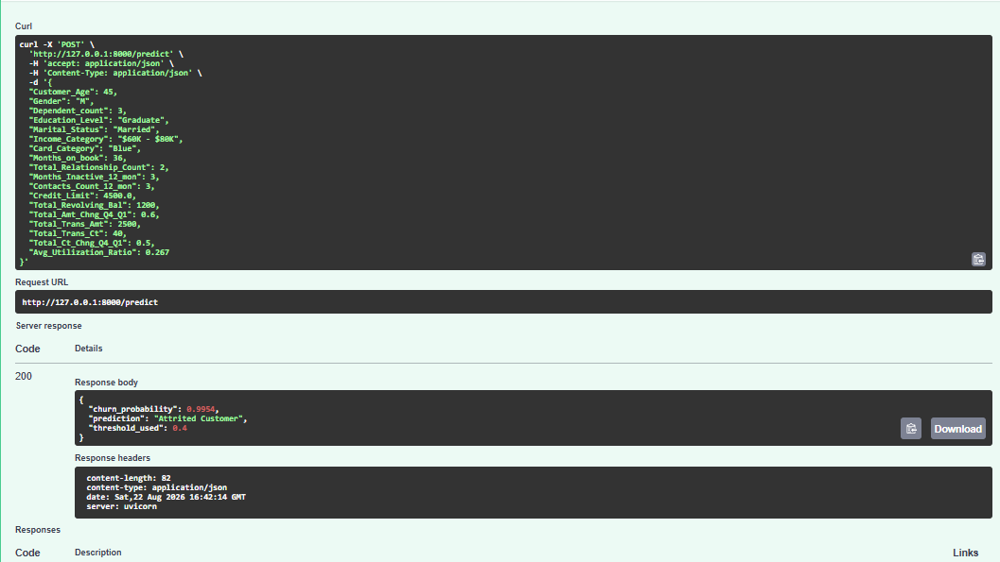

# Credit Card Customer Churn Prediction


A **production-grade, end-to-end machine learning project** that predicts
credit card customer churn — from raw data to a Dockerized REST API —
following a complete 19-phase ML lifecycle.

**Author:** Prajjwol Pudasaini

---

## Table of Contents

- [Business Problem](#business-problem)
- [Project Highlights](#project-highlights)
- [Results](#results)
- [Project Structure](#project-structure)
- [Architecture](#architecture)
- [Quickstart — Local](#quickstart--local)
- [Quickstart — Docker](#quickstart--docker)
- [API Usage](#api-usage)
- [Experiment Tracking](#experiment-tracking)
- [Drift Monitoring](#drift-monitoring)
- [Dataset](#dataset)
- [Reproducing the Model](#reproducing-the-model)
- [Tech Stack](#tech-stack)
- [Key Design Decisions](#key-design-decisions)

---

## Business Problem

Customer churn is one of the most costly problems in banking. Acquiring a
new credit card customer costs 5–7x more than retaining an existing one.
This project builds a machine learning system that identifies customers
at high risk of churning **before** they leave, enabling targeted retention
campaigns that prioritise the right customers at the right time.

**Target variable:** `Attrition_Flag` — whether a customer closed their
credit card account (`Attrited Customer`) or remained active
(`Existing Customer`).

**Key business constraint:** Missing a churner (false negative) is far more
costly than a false alarm (false positive). The model is optimised for
**Recall** over raw Accuracy, and a threshold of **0.40** (below the default
0.50) was selected to maximise F1 while keeping Recall above 85%.

---

## Project Highlights

- **Realistic class imbalance** — ~16% churn rate (not a toy balanced dataset)
- **Domain-driven feature engineering** — `high_risk_segment` (r=0.442 with
  churn), `is_min_credit_limit`, engineered from EDA insights
- **Production-grade code structure** — modular `src/` package with custom
  sklearn transformers, fully importable and testable
- **Experiment tracking** — all model comparison runs and the final model
  registered in MLflow with full parameter and metric history
- **REST API** — FastAPI service with Pydantic validation, auto-generated
  Swagger docs, and a health check endpoint
- **Containerized deployment** — Docker image that runs identically on any
  machine without any local Python setup
- **Drift monitoring** — PSI and Jensen-Shannon divergence computed across
  17 features, with automated retraining alerts logged to MLflow

---

## Results

### Model Comparison (Phase 8)

| Model | Threshold | Precision | Recall | F1 | ROC-AUC |
|---|---|---|---|---|---|
| Logistic Regression | 0.35 | 0.75 | 0.70 | 0.72 | 0.94 |
| KNN | 0.20 | 0.65 | 0.75 | 0.70 | 0.92 |
| Random Forest | 0.30 | 0.80 | 0.87 | 0.84 | 0.98 |
| **XGBoost (selected)** | **0.40** | **0.95** | **0.89** | **0.92** | **0.99** |

### Final Model Performance (XGBoost, Test Set)

| Metric | Score |
|---|---|
| Precision | 0.95 |
| Recall | 0.89 |
| F1-Score | 0.92 |
| PR-AUC | 0.969 |
| ROC-AUC | 0.993 |
| Missed Churner Rate | 11.1% |

XGBoost was selected for its superior performance across all metrics,
particularly its **PR-AUC of 0.969** — the most informative metric under
class imbalance, measuring performance across all possible thresholds.

---

## Project Structure

```
credit-card-churn/
├── src/
│   ├── __init__.py              # makes src an importable package
│   ├── features.py              # ChurnFeatureEngineer, ChurnEncoder,
│   │                            # column_selector — custom sklearn transformers
│   └── pipeline.py              # load_pipeline(), build_pipeline(),
│                                # load_metadata() — assembly and loading logic
├── models/
│   └── model_metadata.json      # single source of truth: hyperparameters,
│                                # threshold, feature order, performance summary
├── Notebooks/
│   └── modelling.ipynb          # full analytical record: EDA, feature
│                                # engineering, model comparison, evaluation
├── main.py                      # FastAPI application — /predict endpoint
├── monitoring.py                # drift detection: PSI + Jensen-Shannon
├── mlflow_test.py               # logs Phase 8 comparison runs to MLflow
├── Dockerfile                   # containerization recipe
├── .dockerignore                # excludes dev/data files from image
├── requirements.txt             # production dependencies (8 packages)
├── requirements-dev.txt         # full development dependencies
└── README.md
```

---

## Architecture

```
┌─────────────────────────────────────────────────────────────┐
│                      DATA LAYER                             │
│  BankChurners.csv (Kaggle) → EDA → Feature Engineering     │
└─────────────────────┬───────────────────────────────────────┘
                      │
                      ▼
┌─────────────────────────────────────────────────────────────┐
│                    TRAINING LAYER                           │
│                                                             │
│  src/features.py          src/pipeline.py                   │
│  ├── ChurnFeatureEngineer  ├── build_pipeline()             │
│  ├── ChurnEncoder          └── load_pipeline()              │
│  └── column_selector                                        │
│                                                             │
│  sklearn Pipeline:                                          │
│  feature_engineering → encoding → column_selection          │
│  → XGBClassifier (n_estimators=300, max_depth=4)           │
└─────────────────────┬───────────────────────────────────────┘
                      │
                      ▼
┌─────────────────────────────────────────────────────────────┐
│                  EXPERIMENT TRACKING (MLflow)               │
│                                                             │
│  Experiment: credit-card-churn-prediction                   │
│  ├── Run: logistic_regression_baseline                      │
│  ├── Run: random_forest                                     │
│  ├── Run: knn                                               │
│  ├── Run: xgboost_untuned                                   │
│  └── Run: xgboost_final_registered                          │
│                                                             │
│  Model Registry: churn-predictor v1                         │
└─────────────────────┬───────────────────────────────────────┘
                      │
                      ▼
┌─────────────────────────────────────────────────────────────┐
│                  SERVING LAYER                              │
│                                                             │
│  main.py (FastAPI)                                          │
│  ├── GET  /         → health check                          │
│  └── POST /predict  → churn probability + label             │
│                                                             │
│  Pydantic validation → DataFrame → Pipeline → Prediction    │
└─────────────────────┬───────────────────────────────────────┘
                      │
                      ▼
┌─────────────────────────────────────────────────────────────┐
│                  DEPLOYMENT LAYER (Docker)                  │
│                                                             │
│  FROM python:3.12-slim                                      │
│  COPY src/ models/ main.py requirements.txt                 │
│  RUN pip install -r requirements.txt                        │
│  CMD uvicorn main:app --host 0.0.0.0 --port 8000           │
│                                                             │
│  docker build -t churn-predictor .                          │
│  docker run --rm -p 8000:8000 churn-predictor              │
└─────────────────────┬───────────────────────────────────────┘
                      │
                      ▼
┌─────────────────────────────────────────────────────────────┐
│                  MONITORING LAYER                           │
│                                                             │
│  monitoring.py                                              │
│  ├── PSI for 12 numerical features                          │
│  ├── Jensen-Shannon for 5 categorical features              │
│  ├── Retraining alert at drift rate >= 30%                  │
│  └── Drift metrics logged to MLflow                         │
└─────────────────────────────────────────────────────────────┘
```

---

## Quickstart — Local

### Prerequisites
- Python 3.11+
- Git

### Setup

```bash
# Clone the repository
git clone https://github.com/prajjwolpudasaini975-ux/churn-mlops-pipeline.git
cd credit-card-churn

# Create and activate a virtual environment
python -m venv venv
source venv/bin/activate        # Mac/Linux
venv\Scripts\activate           # Windows

# Install dependencies
pip install -r requirements.txt
```

### Download the Dataset

Download `BankChurners.csv` from
[Kaggle — Credit Card customers](https://www.kaggle.com/datasets/sakshigoyal7/credit-card-customers)
and place it in `Data/Bank_churn.csv`.

### Reproduce the Model

Open `Notebooks/modelling.ipynb` and run all cells. This trains the
XGBoost pipeline and saves `models/churn_pipeline.joblib`.

Alternatively, if you already have the `.joblib` file:

```python
from src.pipeline import build_pipeline
import joblib

pipeline = build_pipeline()
pipeline.fit(X_train_raw, y_train)
joblib.dump(pipeline, 'models/churn_pipeline.joblib')
```

### Run the API

```bash
uvicorn main:app --reload
```

Visit `http://127.0.0.1:8000/docs` for the interactive Swagger UI.

---

## Quickstart — Docker

No Python installation required.

```bash
# Build the image
docker build -t churn-predictor .

# Run the container
docker run --rm -p 8000:8000 churn-predictor
```

Visit `http://127.0.0.1:8000/docs`.



---

## API Usage

### Health Check

```bash
GET http://127.0.0.1:8000/
```

```json
{
  "status": "alive",
  "model": "churn-predictor",
  "version": "1.0.0"
}
```

### Predict Churn

```bash
POST http://127.0.0.1:8000/predict
Content-Type: application/json
```

**Request body:**

```json
{
  "Customer_Age": 45,
  "Gender": "M",
  "Dependent_count": 3,
  "Education_Level": "Graduate",
  "Marital_Status": "Married",
  "Income_Category": "$60K - $80K",
  "Card_Category": "Blue",
  "Months_on_book": 36,
  "Total_Relationship_Count": 2,
  "Months_Inactive_12_mon": 3,
  "Contacts_Count_12_mon": 3,
  "Credit_Limit": 4500.0,
  "Total_Revolving_Bal": 1200,
  "Total_Amt_Chng_Q4_Q1": 0.6,
  "Total_Trans_Amt": 2500,
  "Total_Trans_Ct": 40,
  "Total_Ct_Chng_Q4_Q1": 0.5,
  "Avg_Utilization_Ratio": 0.267
}
```

**Response:**

```json
{
  "churn_probability": 0.9954,
  "prediction": "Attrited Customer",
  "threshold_used": 0.4
}
```

### Input Fields

| Field | Type | Description |
|---|---|---|
| Customer_Age | int | Customer age in years |
| Gender | str | M or F |
| Dependent_count | int | Number of dependents |
| Education_Level | str | Uneducated / High School / College / Graduate / Post-Graduate / Doctorate / Unknown |
| Marital_Status | str | Single / Married / Unknown |
| Income_Category | str | Less than $40K / $40K-$60K / $60K-$80K / $80K-$120K / $120K+ / Unknown |
| Card_Category | str | Blue / Silver / Gold / Platinum |
| Months_on_book | int | Months as a customer |
| Total_Relationship_Count | int | Number of products held |
| Months_Inactive_12_mon | int | Months inactive in last 12 months |
| Contacts_Count_12_mon | int | Contact count in last 12 months |
| Credit_Limit | float | Credit limit on the card |
| Total_Revolving_Bal | int | Total revolving balance |
| Total_Amt_Chng_Q4_Q1 | float | Change in transaction amount Q4 vs Q1 |
| Total_Trans_Amt | int | Total transaction amount (last 12 months) |
| Total_Trans_Ct | int | Total transaction count (last 12 months) |
| Total_Ct_Chng_Q4_Q1 | float | Change in transaction count Q4 vs Q1 |
| Avg_Utilization_Ratio | float | Average card utilization ratio |

---

## Experiment Tracking

All model comparison runs and the final registered model are tracked
in MLflow. To launch the UI:

```bash
mlflow ui --backend-store-uri sqlite:///mlflow.db --workers 1
```

Visit `http://127.0.0.1:5000`.


The following experiments are logged:

- **`credit-card-churn-prediction`** — 5 runs: 4 model comparisons +
  final registered XGBoost pipeline
- **`churn-model-monitoring`** — drift monitoring runs with PSI and
  Jensen-Shannon metrics per feature

---

## Drift Monitoring

`monitoring.py` detects when the incoming data distribution shifts
away from the training distribution, signalling that the model may
need retraining.

```bash
py monitoring.py
```

**Metrics computed:**
- **PSI** (Population Stability Index) for 12 numerical features
- **Jensen-Shannon Divergence** for 5 categorical features

**Thresholds:**

| PSI | Status |
|---|---|
| < 0.10 | Stable |
| 0.10 – 0.25 | Moderate drift — investigate |
| > 0.25 | Major drift — retraining recommended |

A retraining alert fires automatically when drift rate exceeds 30%
of monitored features, printing a numbered action plan and logging
the alert to MLflow.

---

## Dataset

**Source:** [Kaggle — Credit Card customers](https://www.kaggle.com/datasets/sakshigoyal7/credit-card-customers)
by Sakshi Goyal

**Size:** 10,127 customers, 23 features

**Class distribution:**
- Existing Customer: 83.9% (8,500)
- Attrited Customer: 16.1% (1,627)

The dataset was chosen deliberately over the commonly used IBM Telco
dataset for its realistic class imbalance and domain relevance to
financial services.

---

## Reproducing the Model

The model is not included in this repository (binary artifacts belong
in a model registry, not in Git). To reproduce it:

1. Download the dataset (see [Dataset](#dataset))
2. Run `Notebooks/modelling.ipynb` end to end
3. The notebook saves `models/churn_pipeline.joblib` automatically

Key reproducibility anchors:
- `random_state=42` throughout
- `model_metadata.json` documents all hyperparameters and the
  decision threshold
- `src/features.py` contains all feature engineering logic with
  the `high_risk_segment` boundary (54) documented and locked

---

## Tech Stack

| Category | Tool |
|---|---|
| Language | Python 3.12 |
| ML Framework | scikit-learn 1.9.0 |
| Gradient Boosting | XGBoost 2.1.1 |
| API Framework | FastAPI 0.141 |
| Data Validation | Pydantic 2.13 |
| ASGI Server | Uvicorn 0.52 |
| Experiment Tracking | MLflow 3.15.1 |
| Containerization | Docker 29.7.2 |
| Data Manipulation | pandas 2.3.3, numpy 2.5.2 |
| Serialization | joblib 1.5.3 |

---

## Key Design Decisions

**Why XGBoost over Random Forest?**
XGBoost outperformed Random Forest on every metric, particularly
PR-AUC (0.969 vs 0.98 ROC-AUC but stronger under imbalance).
Its built-in handling of missing values and sequential error
correction made it well-suited for this dataset.

**Why threshold 0.40 instead of 0.50?**
The default 0.50 threshold missed too many churners (high false
negatives). Given the business cost asymmetry — missing a churner
is far more costly than a false alarm — the threshold was lowered
to 0.40, maximising F1 while keeping Recall above 85%.

**Why PSI for numerical and Jensen-Shannon for categorical drift?**
PSI is the banking industry standard for numerical feature monitoring,
with well-established thresholds (0.10, 0.25). Jensen-Shannon
divergence handles categorical features more naturally than PSI,
since it operates directly on probability distributions over
categories without requiring binning.

**Why separate `requirements.txt` and `requirements-dev.txt`?**
The Docker image only needs 8 packages to serve predictions. Installing
all 126 development dependencies (MLflow, SHAP, Jupyter, etc.) into
the container would make the image unnecessarily large and slow to
build. Separating production from development dependencies is a
standard practice for keeping deployment artifacts lean.

---

*Built as a complete portfolio demonstration of the end-to-end ML
lifecycle — from business understanding through production deployment
and monitoring.*